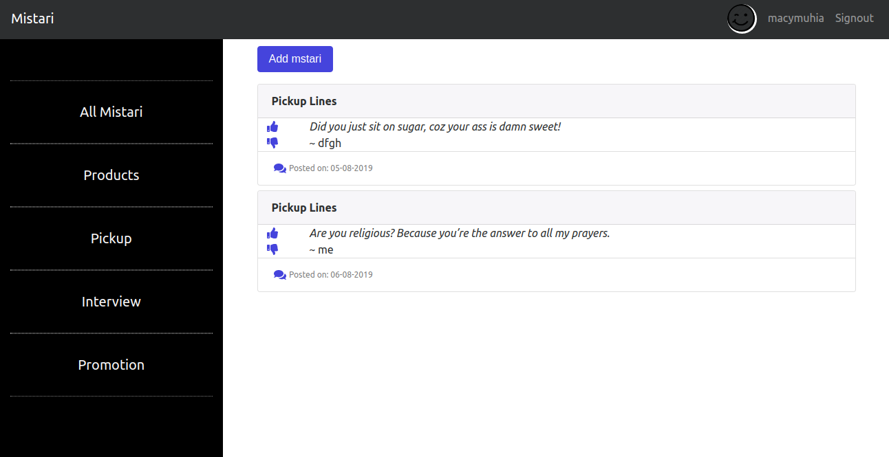

# MISTARI
## Description
Mistari is an app that allows users to post their minute pitches to try get opinion from an online community on whether the pitch sounds great or how they should change it through a comments section.
## Mistari Screenshot


Last modified 6th August 2019.
#### By **Mercy Muhia**

## Project behaviour

A user can see other people's mistari
A user can downvote or upvote mistari
A user can sign up and sign in to comment on mistari
A user should receive a welcome email on sign up
A user can view personal mistari in own profile page
A user can submit mistari in any category
A  user can view the different categories of mistari

 
## Setup/Installation Requirements
```Git clone https://github.com/macymuhia/Mistari.git```

```cd Mistari```

```python3.6 -m venv --without-pip venv_pitchez```

```source venv_pitchez/bin/activate```

```curl https://bootstrap.pypa.io/get-pip.py | python```

```pip install -r requirements.txt```

```export SECRET_KEY=<SET_YOUR_SECRET_KEY>```

```python manage.py server```

## Technologies Used
Python3.6 (Flask), HTML & CSS
## Support and contact details
To contribute, submit a pull request. 
For questions or concerns, reach out on mercy8muhia@gmail.com
### License
*MIT*

### &copy; 2019 Mercy Muhia